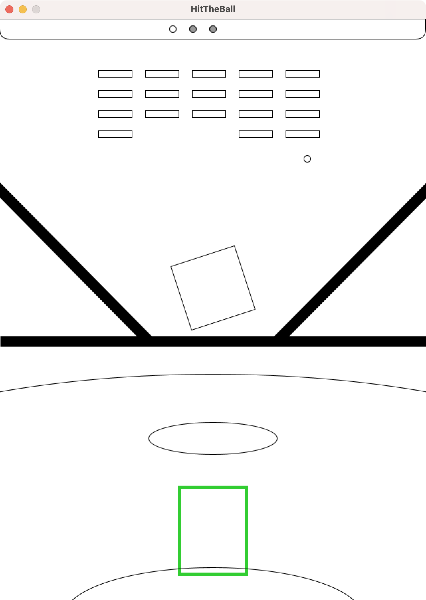
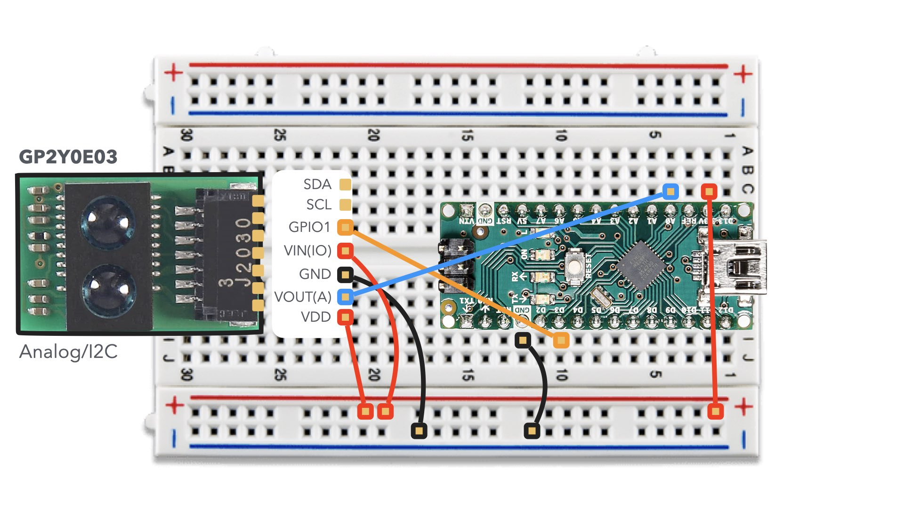
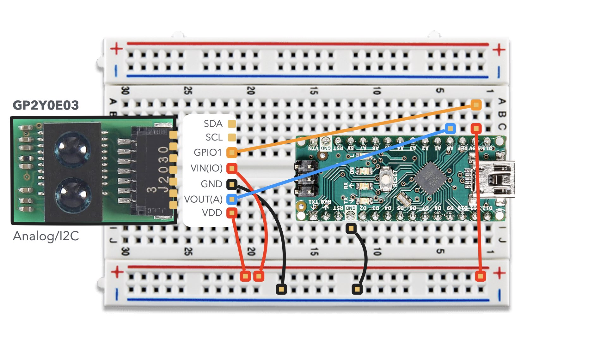

# K214 Final - Block breaker game project with Physical computing
## 打て！ブロック崩し

## Controller device circuit image
- USB Type C to Micro B cable for serial communication
- Arduino Nano
- GP2Y0E03 [[Datasheet](https://jp.sharp/products/device/doc/opto/gp2y0e02_03_appl_j.pdf)]

### GPIO Control

### Always On

## Comments from the lecture

### 新規性についての具体的なコメント・アドバイス等(挙げられていない類似作品やアイディアを知っていたら具体的に教えてください)

- 謎解き要素が充実していて頭を使います
- DSをアナロジーしていて面白いと思いました。
- 初期のxpシステム時代の三次元パチンコゲームを思わせる
- 野球のような軌道やフィールドなど、工夫点が多々あって新規性が高いと思った
- 実際に体を動かしてボールを打つことをブロック崩しに使用している点が新規性があっていいと感じた。
- 野球と組み合わせているのは見たことがない
- 野球ゲームの要素を取り入れ，バットを振る動作で操作するようにしているところに新規性があると思いました．
- ３DSのような要素を参考にしたということで、実際にどうなのかはわからない
- 実空間の動作をゲームに反映していて新しいブロック崩しだと思った
- 画面を２分割する点が新規性がある。
- 野球の動作と組み合わせているのは新規性があるなと思いました。
- 新しい提案ではあるが、ブロック崩しなのかと聞かれるとうーん。。。。。という感じ

### 有用性についての具体的な コメント- アドバイス等

- ストーリーが面白くて引き込まれました
- 2画面Uiを構想したのは素晴らしい．
- タイミングや多少の運要素は面白そうです。
- 体を動かしてプレーするのが面白そうだと思いました．
- 本物の野球のような動きが求められ、スポーツ技能向上？にもつながる有用性が高いと思った
- バットを振るモーションでボールを飛ばすのは楽しく幅が広がりそうで有用だと感じる。
- 運動不足解消になると思いました．
- 体を使って行うのは楽しそう。でもボールを打って、眺める時間があってその眺める時間が少しもったいない気がしました
- 実際に体を動かすのは楽しそうだと思った。
- タイミングで反射する点がが有用性がある。
- ブロック崩しの要素を追加してタイミングによってボールの勢いが変化するようにしても面白そうだなと思いました。

### その他の質問・アドバイス・励まし・コメント等(作品について有益なコメントは積極的に評価します)

- グラフィックの細部にまでこだわりが感じられます
- 実世界の動きと融合させた良作ですね．実装が追い付けばよかった．
- 多岐に渡るハードウェアを組み合わせて目的の機能を実現していて素晴らしいと思う。ゲームの難易度やプレイの楽しさも良い。
- 聞いていて面白そうだと思ったが、いまいちよくわからなかった
- 面白いセンサだと思います。
- 距離センサでバットの認識するのが面白いなと思いました。
- ブロックを崩すことではなく、バッティングを楽しませることによってブロックが崩れる優先度が逆となるゲームでとても新規性のあるものだと思いました。
- 大きく体を動かしてゲーム体験を得れるのは非常に面白そうだと思いました
- 接触判定を利用した野球の動作表現は面白く、ほかのスポーツにおいても発展できる可能性を秘めていると思った
- 画面は黒白で、改善したらより良いと思う。
- 打つことが分かったが、上の画面でボールがどのタイミングで発射されているのかが一見わかりにくかったと感じた。そのため、下の画面で打ったボールを下から直接上の画面に行くようにするともっと見やすくなるのではないかと感じた。
- バットを振りぬかないのはなぜか気になった
- ボタン操作ではなく，バットを振るという動作で操作できるようにしているところが面白かったです．
- ボールを打ち終わったときのちょっと退屈な時間をせっかくの野球モチーフだからこそのランナーみたいな要素とか組み合わせられたら、打ち終わった後の時間も無駄なく楽しめる要素を作れそう。始まりの合図の1,2,3スタートみたいなところは音で表現していた部分も体感でわかりやすくてよかった。
- 現実に拡張できてるのが良いと思った
- クリア条件の工夫とピッチャーの工夫次第で楽しくなる気がしました。
- 前回のゲームも完成度や評価が高い中で、最終試験で異なる種類のものを提案されることは素晴らしいと思いました。ゲーム自体も面白いと思いました。
- ボールを打っているのがプログラムでもわかりやすいとよかった
- 野球のように、最初ボールを飛んできて、適当なタイミングにswingしたらいいなと思います
- 野球のバットを振る動作だけでなくサッカーやバスケットの動作でも活用できそうで応用性が高そうだなと思いました。
