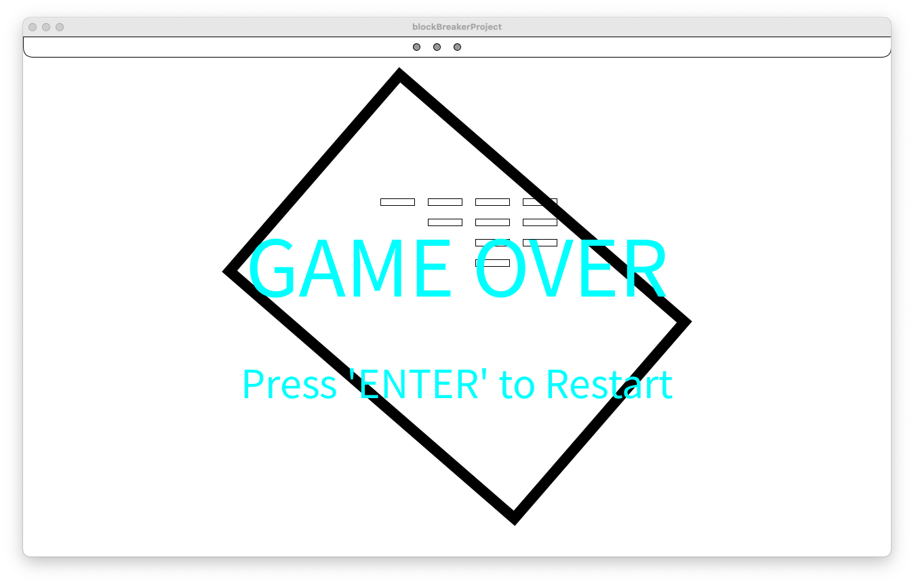

# K214 Midterm - Block breaker game project
## 回るプロック崩し

This game reflects the ball by controlling the rotation of the game frame instead of controlling the bar like in typical block breaker games. This makes it impossible for players to predict the angle of reflection, allowing them to pursue new fun through uncertainty.

## Comments from the lecture

### 新規性についての具体的なコメント- アドバイス等(挙げられていない類似作品やアイディアを知っていたら具体的に教えてください)
- よくサーベイがなされている，いい研究だ．アイデアも斬新だ．
- フレーム自体が回るという新規性がある
- きちんとサーベイしていて、説明が上手だった
- バーを無くしちゃってそのほかのものでボールを打ち返すのは新しさを感じた
- バーをフレームとしてゲームを楽しめるのは面白いと思いました
- 環境そのものを動かしてしまうというコンセプトに新規性を感じました．
- 枠でフィールドを定め、枠線によってボールを反射する考えは、講義で行った３Dの立体図形を思い出し、より動的なゲームになると思った
- フレームの回転でやっているというのは見たことが無かった
- バーが四角く囲まれておりそれを回すというアイデアは良かったと思います。
- バーではなくブロックの周りにあるフレームを回転させることでボールを打ち返すシステムは新規性があるしとてもおもしろそうだと思った。
- バーがなくなり、ゲームを囲むフレームをバーのようにするというのはブロック崩しの新しい視点として面白かった。
- フレームでボールを弾くアイディアは面白いと思いました。
- バーの概念を無くしたアイディアは新しいです。

### 有用性についての具体的な コメント- アドバイス等
- ボールがどこにも行かないという有効性がある
- シーンは回転しているものの、ブロックは回転せず、シーンの端を通り抜けてしまいます。
- ゲームオーバの要素を作るとハラハラ感が増して面白そうだなと思いました！
- ブロックに細工している人と組み合わせられそうな点で有用性を感じた
- 予測不可能である点が面白いと思いました
- 四角でも十分楽しいが、三角などほかの多角形でも違った反射の仕方をして面白くなると思った
- 狙ったところに返せるという理論値はあるのに、まったくそれをさせなさそう。これがとてもいい。しかも普通のブロック崩しは「この反射でブロック壊せないじゃん」みたいな意味のないタイミングがあるのに、この作品にはそういった無駄な時間が一切ない。最後までちゃんと遊びきれるのが本当に良い
- 打球の角度が毎回変わるのでその点が非常に興味深いと思いました。
- 有用性あり。
- ゲームとしてもどのようにフレームを回してブロックを崩すのかを考えるのは楽しそうだ。
- 四角の壁に当たった回数をカウントし、一定以下ならクリアという形にしてもいいかもしれない
- フレームがなくなっていくアイディアも面白いと思いました。

### その他の質問- アドバイス- 励まし- コメント等(作品について有益なコメントは積極的に評価します)
- バーをなくす斬新なアイデアがとても良いと思いました。
- よくサーベイがなされている，いい研究だ．いろんな枠のかたちを試したいね．
- バーを回転するフレームに置き換えることで、全く新しい操作感を実現していて素晴らしいと思う。
- フレームが動くことで反射するというアイデアがとても面白いと思った
- ブロックを境界からもっと遠くに配置するか、ブロックも回転するように設定できます。
- フレームを操作するというアイデアは思いつかなかったので面白いと思った。バグは、ボールの動作スピードとフレームの動作スピードの差異を調整すればなおりそうだと思った。
- 私にはない発想で、ぜひプレイしたいと思えるゲームだった。
- バグ取りは大変ですよね。是非バグ取りの終わったゲームをプレイしてみたいです
- フレーム自体が回るという点が今までそこまで見てこなかったためよかったと感じた。また、ボールがなくならないという点でも、バグでなくなってしまったらゲームオーバーと出るため、そこまでの配慮もされており素晴らしいと感じた
- フレームを動かせるのは予想外だった。面白そうではあるが、とても難しそうだったので、もしもより多くの人にプレイしてもらうならボールやフレームの回転速度を遅くすると良いと感じた。
- 発想が面白かったです．
- 外れ判定がバグになっていたため、実際は枠線に穴をあけるなどして外れ判定を行っても楽しめると思った
- 少し気になったのが、フレーム(バー)に当たったとき、ボールの速度が上がっているのが気になりました。多分バグとしてボールが外に出てしまうのは、その速度アップが原因な気がします。フレームレートがノートパソコンだとそこまで高くないので、ボールがフレーム(バー)の中にめり込んでしまって、フレーム(バー)が正面(勘違いで全くの逆)から来たと勘違いして、ボールを逆に押し出してしまっているのかと思いました。もしくは、ボールがめり込んで、接点がボールの中心あたりになってボールの円周にちゃんと当たってない可能性が考えられました。
- ブロックを崩すごとに四角から三角へ、三角から丸などバーの形を動的に変えてみると面白いかもしれません。
- ブロックの周りを完全に囲むようなフレームの場合、負け自体が存在しなくなってしまうので、フレームの一部をなくす（コみたいな形状）にするとさらに面白いと思う。
- 面白そうだ。
- ミスの要素があればより面白くなるかなと思いました。
- アイデアは面白いので，もっと自信を持って話してほしい
- 壁がだんだんなくなるが実装されることでミスの可能性が出るので、良い気はしました。跳ね返るまでの時間も短くなりユーザーが忙しいのも良い点だと感じます。
- フレームの制御方法は？回転方向をプレイヤーが決めることができますか？
- バーがボックスになる形は斬新に感じました。もっと進展出来る可能性を感じました。
